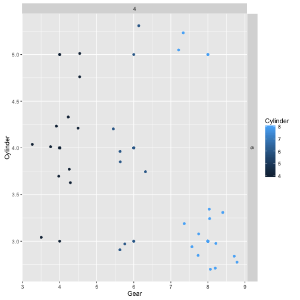

Motor Data Project
========================================================
author: Lalitha Sastry
date: 24-Mar-2016

Sysnopsis
========================================================

This project demos the skills of using Shiny tools with R language. I'm processing motor data to display GPLOT. The plot gets feed from the user w.r.t Cylinder and Gear values. THis is a peer assesement activity for "Session9 - Developing Data Products".

### References:
https://stat.ethz.ch/R-manual/R-devel/library/datasets/html/mtcars.html
http://shiny.rstudio.com/articles/shinyapps.html

Introduction - Project Links
========================================================

In, Motor Trend, a magazine about the automobile industry, is interested to explore the data set "mtcars" to analyze the relationships/impact of regression on the variables in the data set. We are going to apply linear models, generalized linear models, binary models, residuals, predictions, hatvalues, t-test, interpreting odds ration and other regression models learned in this session. "mtcars" data set was extracted from the 1974 Motor Trend US magazine, and comprises fuel consumption and 10 aspects of automobile design and performance for 32 automobiles (1973–74 models). The data frame has 32 observations and 11 variables.
In this project we will explore the linear model between Cylinder and Gear values. Using GGPlot, I'm making a static plots on selecting the 2 values.

**GIT**: https://github.com/lpisapati/ShinyCourseProject  
**RPubs**: http://rpubs.com/plalithas/ShinyCourseProject  
**shinyapps.io**: https://lalithasastryp.shinyapps.io/ShinyCourseProject/

What you can do?
========================================================
App helps you to select the Cylinder and Gear values from MTCARS datasets.
First choose the gear and cylinder from the given list. Later you can select the jitter/smooth conditional mean to be added to the plot


Slide With Code
========================================================


```r
head(mtcars)
```

```
                   mpg cyl disp  hp drat    wt  qsec vs am gear carb
Mazda RX4         21.0   6  160 110 3.90 2.620 16.46  0  1    4    4
Mazda RX4 Wag     21.0   6  160 110 3.90 2.875 17.02  0  1    4    4
Datsun 710        22.8   4  108  93 3.85 2.320 18.61  1  1    4    1
Hornet 4 Drive    21.4   6  258 110 3.08 3.215 19.44  1  0    3    1
Hornet Sportabout 18.7   8  360 175 3.15 3.440 17.02  0  0    3    2
Valiant           18.1   6  225 105 2.76 3.460 20.22  1  0    3    1
```

Slide With Plot
========================================================


